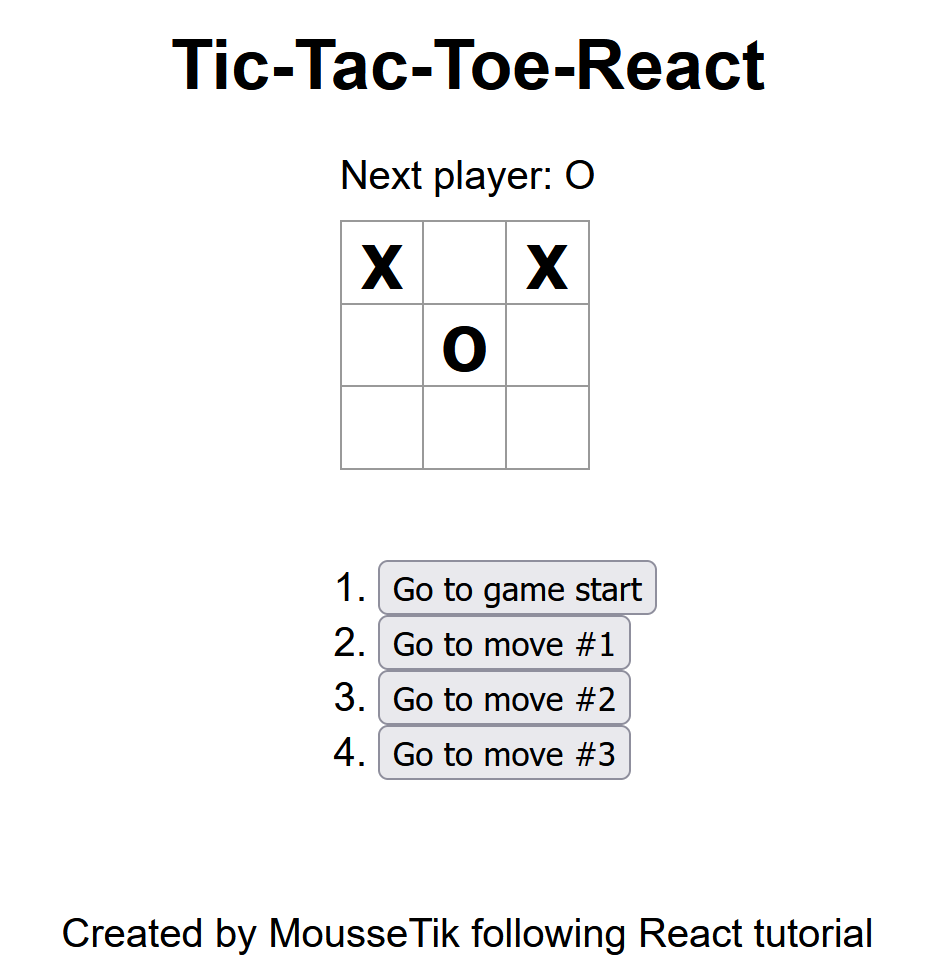

# Tic-tac-toe

## About the Project

This project is a simple Tic-Tac-Toe game built using React. It is a two-player game where players take turns marking a 3x3 grid with "X" or "O". The game determines the winner when a player successfully marks three consecutive squares in a row, column, or diagonal, or declares a draw when all squares are filled with no winner.

This project follows React's component-based architecture and includes features such as state management, handling player turns, and determining the game outcome. I follow this tutorial to make it: <https://react.dev/learn/tutorial-tic-tac-toe>

## How to run it

1. Clone the repository
2. Install Dependencies: Make sure you have Node.js installed, then run the following command to install project dependencies:```npm install```
3. ```npm start``` to run the project

## Screenshots

